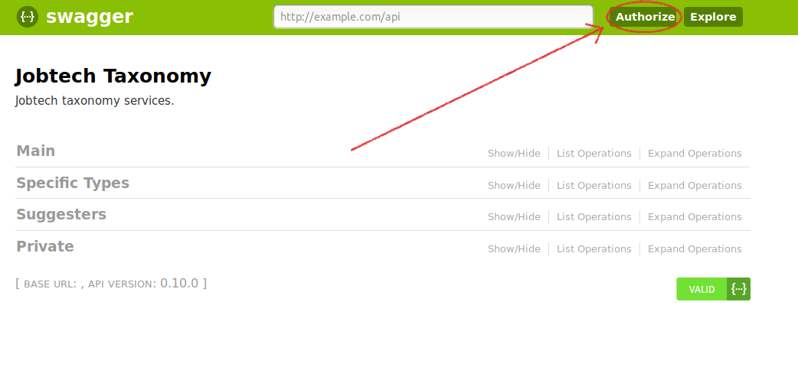

# JobTech Taxonomy - Getting started

The Jobtech Taxonomy API gives access to different taxonomies like occupation names, skills and SSYK, SNI etc. It’s main purpose is to act as a common language for labour market related systems.

[Jobtech Taxonomy API Swagger UI](https://taxonomy.api.jobtechdev.se/v0/taxonomy/swagger-ui/index.html)

In order to use the api you need a key which you need to authenticate yourself.

[How to get a key](https://apirequest.jobtechdev.se/)


# Table of Contents
* [Short introduction](#short-introduction)
* [Authentication](#authentication)
* [Endpoints](#endpoints)
* [Results](#results)
* [Errors](#errors)


## Short introduction
The JobTech Taxonomy API is divided into three sections Main, Specific Types and Suggesters.

The Main section contains the core functionalities of the API like retrieving concepts (words) from different taxonomies. It also has endpoints helping you to track and react to changes in the taxonomies.

The Specific Types section contains typed endpoints for taxonomies that has specific fields like statistical codes for SSYK and SNI.

The Suggesters section contains endpoints that helps end users finding values from the taxonomies when they are creating structured data based on the taxonomies.

For example there is an autocomplete endpoint that suggest concepts that can assist users creating CVs or job ads.


For a more in depth documentation about Jobtech Taxonomy please see this guide:

[https://github.com/JobtechSwe/jobtech-taxonomy-api/blob/master/GETTINGSTARTED.md](https://github.com/JobtechSwe/jobtech-taxonomy-api/blob/master/GETTINGSTARTED.md)

## Authentication

1. Follow the instructions on how to get and api key here. [https://apirequest.jobtechdev.se/](https://apirequest.jobtechdev.se/)

2. If you are using curl you have to add the api-key in the headers like this:

  ``` curl "{URL}" -H "accept: application/json" -H "api-key: {YOUR API KEY}" ```
 
3. If you are using the swagger UI you have to log in with the "Authorize" button in the top right corner and add your api-key.

  

## Endpoints
Below we only show the URLs. If you prefer the curl command, you type it like:

  curl "{URL}" -H "accept: application/json" -H "api-key: {YOUR API KEY}"

### Main


#### /v1/taxonomy/main/concept/types
This endpoint will list all available types in the taxonomies

#### v1/taxonomy/main/relation/types
This endpoint will list all available relation types in the taxonomies.

The broader / narrower relation is for hierarchical relations.

The related relation is a non specific relation like a keyword that is related to an occupation name.

The substitutability relation is for showing related occupations that can substitute one another.
For example, if an employer wants to hire a  “Barnmorska, förlossning" but can’t find any they can do a search for a "Barnmorska, vårdavdelning/BB-avdelning" instead. The substitutability-percentage will show how well the occupation can substitute another occupation.


#### /v1/taxonomy/main/concepts
This endpoint will let you retrieve concepts from different taxonomies.

##### Example List all Skill headlines
```
http://jobtech-taxonomy-api-develop-jobtech-taxonomy-api.test.services.jtech.se/v1/taxonomy/main/concepts?type=skill-headline
```
This request will fetch all concepts of type skill headline.


##### Example Relations
```
http://jobtech-taxonomy-api-develop-jobtech-taxonomy-api.test.services.jtech.se/v1/taxonomy/main/concepts?related-ids=xAWr_WYq_JPP%20Uj5W_dft_Ssg&relation=narrower

```
This request will fetch concepts that has a narrower relation from the concepts “Databaser” and “Operativsystem”.

##### Example 2. Multiple types

```
http://jobtech-taxonomy-api-develop-jobtech-taxonomy-api.test.services.jtech.se/v1/taxonomy/main/concepts?type=ssyk-level-1%20ssyk-level-2%20ssyk-level-3
```
This request will fetch concepts of types ssyk-level-1 ssyk-level-2 and ssyk-level-3


#### /v1/taxonomy/main/graph

This endpoint will list relations between two types of concepts in the taxonomies. It’s main use case is to be able to build tree views of the taxonomy. It will also list extra metadata on the relations.

##### Example Tree view Occupation Field, ssyk-level-4, occupation-name

```

http://jobtech-taxonomy-api-develop-jobtech-taxonomy-api.test.services.jtech.se/v1/taxonomy/main/graph?edge-relation-type=broader&source-concept-type=occupation-name&target-concept-type=ssyk-level-4

http://jobtech-taxonomy-api-develop-jobtech-taxonomy-api.test.services.jtech.se/v1/taxonomy/main/graph?edge-relation-type=broader&source-concept-type=ssyk-level-4&target-concept-type=occupation-field


```
With the help of these two request you can build a tree view bottom up of the occupation-name -> ssyk-level-4 -> occupation-field hierarchy


##### Example Occupation name substitutability

```
http://jobtech-taxonomy-api-develop-jobtech-taxonomy-api.test.services.jtech.se/v1/taxonomy/main/graph?edge-relation-type=substitutability&source-concept-type=occupation-name&target-concept-type=occupation-name&limit=10
```
This request will fetch occupation names that has a substitutability relation to each other.
For example, if an employer wants to hire a  “Barnmorska, förlossning" but can’t find any they can instead use information from this endpoint to search for a "Barnmorska, vårdavdelning/BB-avdelning". The substitutability-percentage will show how well the occupation can substitute another occupation.


#### /v1/taxonomy/main/changes
This endpoint will list all changes that have occurred to the taxonomies. It’s a list of events of the types CREATED, DEPRECATED and UPDATED.

You can use it to be able to react to changes in the taxonomies.
For example if a jobseeker is subscribing to job recommendations based on a specific occupation name and that occupation name becomes deprecated, this endpoint will contain information that the deprecation occurred so you can inform the jobseeker to update their search profile.

##### /v1/taxonomy/main/replaced-by-changes

This endpoint will list all deprecated concepts that has been replaced by another newer concept.

####  /v1/taxonomy/main/versions
This endpoint will list all published versions of the taxonomies.

### Specific
These endpoint acts like the  /v1/taxonomy/main/concepts but will also display specific metadata on the concepts like ssyk or country codes.

### Suggesters

#####  /v1/taxonomy/suggesters/autocomplete
This endpoint is to help end users to find concepts in the taxonomies.

##### Example Autocomplete programming languages starting on “sc”

```
http://jobtech-taxonomy-api-develop-jobtech-taxonomy-api.test.services.jtech.se/v1/taxonomy/suggesters/autocomplete?query-string=sc&type=skill&relation=narrower&related-ids=ShQw_McG_oti


```
With this request you can autocomplete programming languages starting on the letter “sc”


##### Example Autocomplete occupation names with related keywords


```
http://jobtech-taxonomy-api-develop-jobtech-taxonomy-api.test.services.jtech.se/v1/taxonomy/suggesters/autocomplete?query-string=lastb&type=occupation-name%20keyword

http://jobtech-taxonomy-api-develop-jobtech-taxonomy-api.test.services.jtech.se/v1/taxonomy/main/concepts?related-ids=d68E_e74_a59&relation=related


```
Let’s say a user wants to find jobs as a “Lastbilsförare” and starts typing the word “lastb”.

We make a first request to this endpoint also limiting the result to occupation-name and keyword.
The response contains the concept “Lastbilsförare” but not as an occupation-name but as a keyword.

If the user show interest in the word “Lastbilsförare” we can make another request for related occupation names with the  /v1/taxonomy/main/concepts endpoint.


## Results
The results of your queries will be in edn, transit+messagepack or transit+json or JSON.

Successful queries will have a response code of 200 and give you a result set that consists of:
...

## Errors
Unsuccessful queries will have a response code of:

| HTTP Status code | Reason | Explanation |
| ------------- | ------------- | -------------|
| 400 | Bad Request | Something wrong in the query |
| 401 | Unauthorized | You are not using a valid API key |
| 500 | Internal Server Error | Something wrong on the server side |
